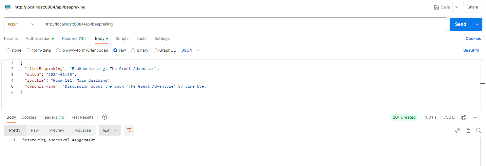

# 📚 Boekenclub Project

Welkom bij ons **Boekenclub Project**! Dit project is een platform voor boekenliefhebbers om samen te komen, boeken te bespreken en recensies te delen. Het is opgebouwd uit een moderne microservice-architectuur met vier onafhankelijke services.

---

## 🚀 Functionaliteiten

- **Ledenbeheer**  
  Beheer informatie over de leden van de boekenclub.

- **Besprekingen**  
  Organiseer en bekijk besprekingen waar leden samenkomen om boeken te bespreken.

- **Recensies**  
  Laat leden recensies schrijven en delen over de gelezen boeken.

- **Boekenbeheer**  
  Houd een overzicht van alle boeken die door de boekenclub worden gelezen.

---

## ⚙️ Microservice Architectuur

Het project bestaat uit de volgende services:

1. **Lid Service**  
   Beheert gegevens van de boekenclubleden.

2. **Bespreking Service**  
   Verantwoordelijk voor het plannen en beheren van besprekingen.

3. **Recensie Service**  
   Handelt het schrijven, bekijken en beheren van recensies af.

4. **Boek Service**  
   Beheert de informatie over de boeken in de club.

### Serverconfiguratie
- **Poort**: 8084

### Logconfiguratie
- **Root Logniveau**: INFO
- **Spring Cloud Gateway Logniveau**: TRACE
- **Reactor Netty Logniveau**: TRACE

### Redis-configuratie
- **Host**: localhost
- **Poort**: 6379

### OAuth2 Authenticatieconfiguratie
- **Google OAuth2 Client ID**: ${GOOGLE_CLIENTID}
- **Google OAuth2 Client Secret**: ${GOOGLE_CLIENTSECRET}
- **Scope**: openid, profile, email
- **Issuer URI**: https://accounts.google.com
- **JWK Set URI**: https://www.googleapis.com/oauth2/v3/certs

### Service Routes

#### Lid Service
- **GET** `/api/lid`  
  URI: `http://${LID_SERVICE_BASEURL:localhost:8080}/api/lid/all`
  
- **POST** `/api/lid`  
  URI: `http://${LID_SERVICE_BASEURL:localhost:8080}/api/lid`
  
- **PUT** `/api/lid/{id}`  
  URI: `http://${LID_SERVICE_BASEURL:localhost:8080}/api/lid/{id}`
  
- **DELETE** `/api/lid/{id}`  
  URI: `http://${LID_SERVICE_BASEURL:localhost:8080}/api/lid/{id}`

### Boek Service
- **GET** `/api/boek`  
  URI: `http://${BOEK_SERVICE_BASEURL:localhost:8082}/api/boek/all`
  
- **POST** `/api/boek`  
  URI: `http://${BOEK_SERVICE_BASEURL:localhost:8082}/api/boek`
  
- **PUT** `/api/boek/{id}`  
  URI: `http://${BOEK_SERVICE_BASEURL:localhost:8082}/api/boek/{id}`
  
- **DELETE** `/api/boek/{id}`  
  URI: `http://${BOEK_SERVICE_BASEURL:localhost:8082}/api/boek/{id}`

### Bespreking Service
- **GET** `/api/bespreking`  
  URI: `http://${BESPREKING_SERVICE_BASEURL:localhost:8083}/api/bespreking`
  
- **POST** `/api/bespreking`  
  URI: `http://${BESPREKING_SERVICE_BASEURL:localhost:8083}/api/bespreking`
  
- **PUT** `/api/bespreking/{id}`  
  URI: `http://${BESPREKING_SERVICE_BASEURL:localhost:8083}/api/bespreking/{id}`
  
- **DELETE** `/api/besprekingen/{id}`  
  URI: `http://${BESPREKING_SERVICE_BASEURL:localhost:8083}/api/bespreking/{id}`

### Recensie Service
- **GET** `/api/recensies`  
  URI: `http://${RECENSIE_SERVICE_BASEURL:localhost:8081}/api/recensies`
  
- **GET** `/api/recensies/{lidId}`  
  URI: `http://${RECENSIE_SERVICE_BASEURL:localhost:8081}/api/recensies/{lidId}`
  
- **POST** `/api/recensies`  
  URI: `http://${RECENSIE_SERVICE_BASEURL:localhost:8081}/api/recensies`
  
- **PUT** `/api/recensies/{id}`  
  URI: `http://${RECENSIE_SERVICE_BASEURL:localhost:8081}/api/recensies/{id}`
  
- **DELETE** `/api/recensies/{id}`  
  URI: `http://${RECENSIE_SERVICE_BASEURL:localhost:8081}/api/recensies/{id}`

---

## 🛠️ Technologieën

- **Backend**: Java Spring Boot
- **Database**: MySQL, MongoDB
- **Architectuur**: Microservices
- **Tools**: Maven, Lombok, Postman (voor testen van APIs)
- **Deployment**: Docker
- **CI/CD**: GitHub Actions

---

## 🌐 Deployment Architectuur

Onderstaande afbeelding geeft de deployment architectuur van het Boekenclub Project weer. Elke service wordt als container gedraaid en beheerd door Kubernetes, waarbij zowel MongoDB als MySQL gebruikt worden voor datastorage.

### Toelichting:
- **API Gateway**: Beheert het inkomende verkeer en routeert verzoeken naar de juiste microservices.
- **Services**: Elke microservice is onafhankelijk en beheert specifieke functionaliteiten zoals lidbeheer, boekbeheer, recensies en besprekingen.
- **Databases**: 
   - MongoDB wordt gebruikt voor ongestructureerde data (Leden en Boeken).
   - MySQL wordt gebruikt voor gestructureerde data (Besprekingen en Recensies).

---

## 🔗 API Endpoints

Hieronder vind je de belangrijkste API-endpoints per service. Screenshots van Postman of de testresultaten zijn toegevoegd.

### Authorization
   

### 1. **Lid Service**
- **GET /api/lid** - Haal alle leden op  
    

- **POST /api/lid** - Voeg een nieuw lid toe  
    

- **PUT /api/lid/{id}** - Werk informatie van een lid bij  
    

- **DELETE /api/lid/{id}** - Verwijder een lid  
    

---

### 2. **Bespreking Service**
- **GET /api/bespreking** - Haal alle besprekingen op  
    

- **POST /api/bespreking** - Maak een nieuwe bespreking  
    

- **PUT /api/bespreking/{id}** - Update een bespreking  
    

- **DELETE /api/bespreking/{id}** - Verwijder een bespreking  
    

---

### 3. **Recensie Service**
- **GET /api/recensies** - Haal alle recensies op  
  

- **GET /api/recensies/{lidID}** - haal recensie op via lidID
  

- **POST /api/recensies** - Voeg een nieuwe recensie toe  
    

- **PUT /api/recensies/{id}** - Update een recensie  
    

- **DELETE /api/recensies/{id}** - Verwijder een recensie  
    

---

### 4. **Boek Service**
- **GET /api/boek** - Haal alle boeken op  
    

- **POST /api/boek** - Voeg een nieuw boek toe  
    

- **PUT /api/boek/{id}** - Update een boek  
    

- **DELETE /api/boek/{id}** - Verwijder een boek  
    

---

## 🧪 **Testing**

- **Unit Tests**: Elke service bevat unit tests om de functionaliteit van endpoints te verifiëren.
- **Postman**: Alle endpoints zijn getest met Postman. Screenshots zijn hierboven toegevoegd.

---

## 📖 Conclusie

Dit project biedt een schaalbare en robuuste oplossing voor een boekenclubplatform door het gebruik van **microservices**, **containerisatie** (Docker, Kubernetes), en moderne ontwikkeltools. Het platform is eenvoudig uitbreidbaar en maakt een duidelijke scheiding tussen services mogelijk.

---

### 💻 **Screenshots en Demo**
- Voeg hier nog screenshots of een demo-video toe indien beschikbaar.

---

